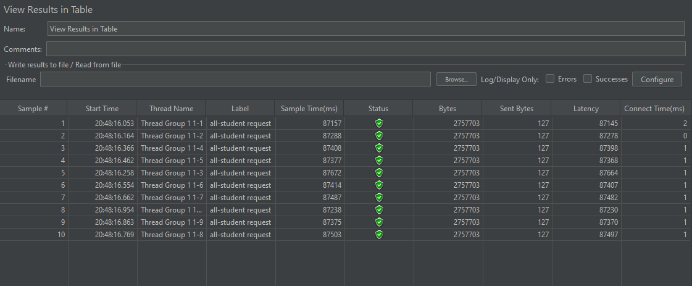
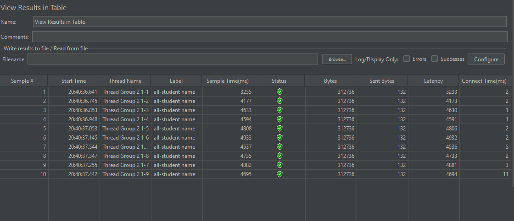
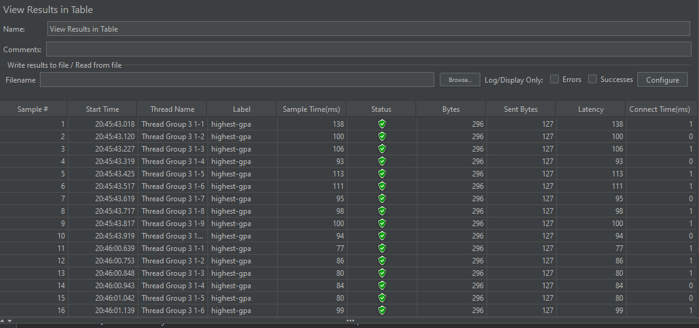

# REFLECTION MODULE 5

## Perbedaan JMeter dan IntelliJ Profiler dalam Optimasi Performa Aplikasi
JMeter dan IntelliJ Profiler memiliki pendekatan berbeda dalam meningkatkan performa aplikasi. 
JMeter berfokus pada pengujian kinerja dengan mensimulasikan beban tinggi, seolah-olah banyak pengguna 
mengakses aplikasi secara bersamaan. Sementara itu, IntelliJ Profiler berfungsi untuk mengidentifikasi 
bottleneck dalam aplikasi yang menyebabkan lambatnya kinerja.

## Proses Profiling
Profiling sangat bermanfaat dalam mendeteksi bagian aplikasi yang menghambat performa. 
Profiler mengumpulkan data terkait penggunaan CPU, alokasi memori, aktivitas garbage collection, 
serta concurrency antar thread. Dari analisis ini, kita bisa memahami bagian mana yang perlu dioptimalkan.

## Efektivitas IntelliJ Profiler
Menurut saya, IntelliJ Profiler sudah cukup efektif dalam mengidentifikasi bottleneck. 
Flame graph yang disediakan memungkinkan kita melihat bagian kode yang memakan waktu eksekusi lama. 
Selain itu, tab Method List memberikan informasi terkait Execution Time, sehingga kita dapat membandingkan 
perubahan waktu eksekusi setelah optimasi tanpa perlu menghitung peningkatan performa secara manual.

## Tantangan dalam Performance Testing dan Profiling
Beberapa tantangan yang saya hadapi dalam proses ini meliputi:

Memahami Hasil Profiling – Saya perlu memahami hasil profiling dengan baik agar bisa melakukan refactoring secara tepat.

## Keunggulan IntelliJ Profiler
Selain keefektifannya, IntelliJ Profiler memiliki keunggulan karena sudah terintegrasi langsung dalam IntelliJ IDEA. Hal ini mengeliminasi kebutuhan untuk menggunakan aplikasi pihak ketiga dan mengurangi kompleksitas dalam melakukan setup profiling.

## Konsistensi Hasil dari IntelliJ Profiler dan JMeter
Sejauh ini, saya belum mengalami ketidakkonsistenan antara hasil profiling IntelliJ Profiler dan pengujian performa menggunakan JMeter. Namun, jika suatu saat terjadi perbedaan hasil, langkah yang akan saya lakukan adalah:

Memeriksa kembali konfigurasi di JMeter dan meninjau kembali hasil profiling di IntelliJ Profiler.

## TEST RESULT

